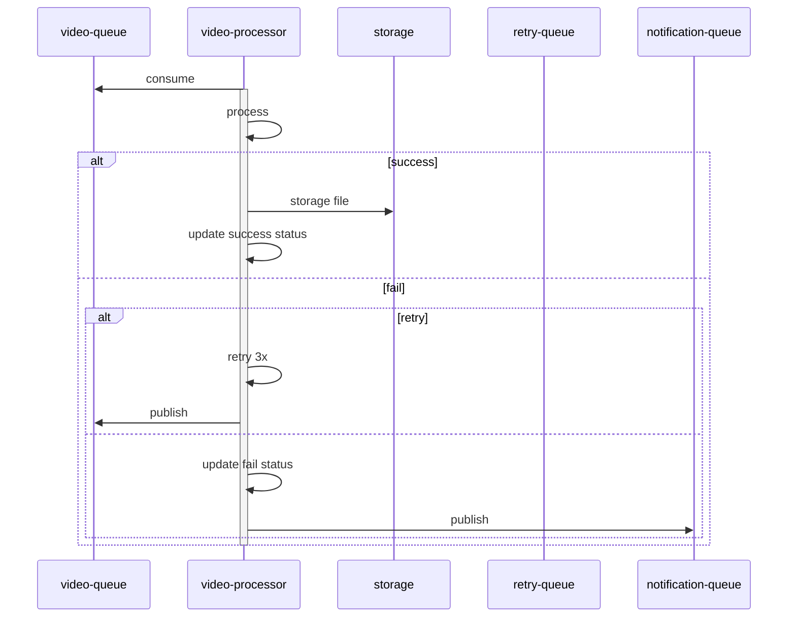

# clipshot-video-processor
Repositório da aplicação de processamento de vídeos - Software Architecture da FIAP.

## fluxo:

```mermaid
sequenceDiagram
    participant video-queue
    participant video-processor
    participant storage
    participant retry-queue
    participant notification-queue
    
    video-processor->>video-queue: consume
    activate video-processor
    video-processor->>video-processor: process
    
    alt success
     video-processor->>storage: storage file
     video-processor->>video-processor: update success status
    else fail
     alt retry
      video-processor->>video-processor: retry 3x
      video-processor->>video-queue: publish
     else
      video-processor->>video-processor: update fail status
      video-processor->>notification-queue: publish
     end   
    end
    deactivate video-processor
```

